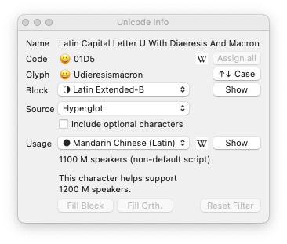

# UnicodeInfo-Glyphs

A Unicode and orthography info window for Glyphs.app.

Bring up the Unicode Info window via _Window > Unicode Info._

When a glyph is selected, or you are editing a glyph, press the **Query** button to update the information displayed in the Unicode Info window.

## Glyph Names and Unicode Codepoints

The top section shows the Unicode name of the queried glyph, as well as the codepoint and the expected glyph name. If there is a mismatch, the smiley will look angry.

- **Assign All** assigns Unicodes to all glyphs based on their names. When you use the automatic naming in Glyphs, this should never be necessary.

- **↑↓ Case** jumps to the corresponding uppercase or lowercase version of the current glyph. In the _Edit_ view, your current glyph will be exchanged with the cased version. In the _Font_ view, the selection is changed from the current glyph to the cased glyph.

## Unicode Block Information

Under _Block,_ the Unicode block which the queried character belongs to is shown. A check mark next to the dropdown menu indicates that your font completely supports this block.

- **Show** can only be used in the _Font_ view and shows all characters your font contains from the selected Unicode block at the top of the _Font_ view. Before you can show another block, you must press **Reset Filter.**

- **Fill Block** adds placeholder glyphs for all missing characters of the selected block to your font.

## Orthography Information

Under _Usage,_ the dropdown contains a list of all orthographies that use the queried character. A check mark next to the dropdown menu indicates that your font completely supports the currently selected orthography.

If you check **Include optional characters,** those will be taken into account for the _Show_ and _Fill_ operations.

- **Show** can only be used in the _Font_ view and shows all characters your font contains from the selected orthography at the top of the _Font_ view. Before you can show another orthography, you must press **Reset Filter.**

- **Fill Orth.** adds placeholder glyphs for all missing characters of the selected orthography to your font.

Whenever you select an orthography that is not fully supported, a list of missing codepoints is printed to the console of the _Macro_ panel.

## Known issues

- When "custom naming" is active, the results of the _Fill_ buttons are unreliable and may lead to duplicate glyphs.

© 2016–2022 by Jens Kutilek.